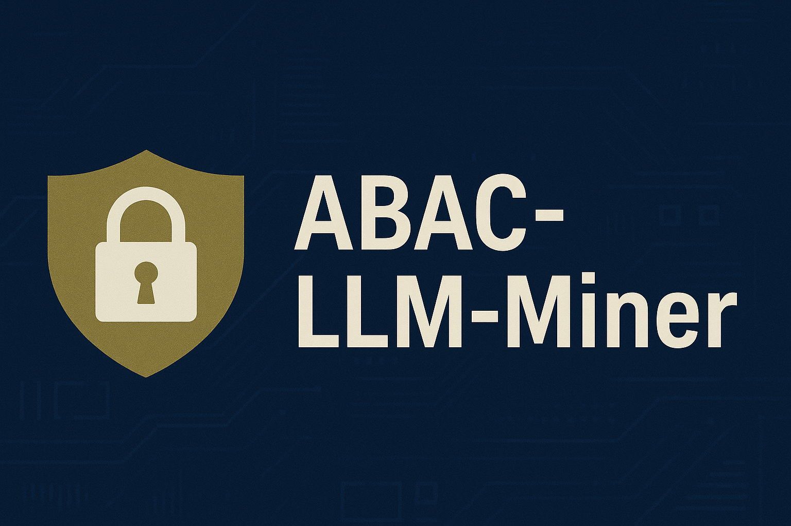

  

# ABAC-LLM-Miner

## Overview

---
---

## Data / Resources
- **Attribute Data Description**  
  - Defines the schema for the ABAC policy  
  - Helps interpret the attribute data file and guides LLMs in constructing rules.  
  - [View Attribute Description](https://github.com/SecOtterLab/ABAC-LLM-Miner/tree/main/DATASETS-for-LLM)

- **Attribute Data**  
  - Contains the actual object model (users and resources with attributes).  
  - Used to generate the ACL and to guide LLMs in constructing rules.  
  - [View Attribute Data](https://github.com/SecOtterLab/ABAC-LLM-Miner/tree/main/DATASETS-for-LLM)

- **Abac Rules**  
  - ABAC rules that define correct access control.  
  - Used to derive the ACL (Access Control List) and for evaluation of LLMs generated rules.  
  - [View Ground Truth Rules](https://github.com/SecOtterLab/ABAC-LLM-Miner/tree/main/ground-truth-ABAC-rules)

- **ACL**  
  - The complete ACL derived from the ABAC rules.  
  - Serves as the baseline that LLM-mined rules must replicate.  
  - [View ACL Files](https://github.com/SecOtterLab/ABAC-LLM-Miner/tree/main/ground-truth-ACL)

#### Code
- **Generate ACL**  
  - Evaluates ABAC rules over users, resources, and actions.  
  - **Behavior:** iterate all users × resources × actions, apply rules, deduplicate, write to file  
  - [generate_acl](https://github.com/SecOtterLab/ABAC-LLM-Miner/tree/main/ground-truth-ACL)

- **API Call**  
  - Interfaces with the LLM to run mining using prepared prompts and return cleaned `rule(...)` lines.  
  - **Behavior:** sends prompts to the API, removes extraneous text, extracts valid rules, and logs outputs and errors.  
  - [api.py](https://github.com/SecOtterLab/ABAC-LLM-Miner/tree/main/llm-research)

- **Mining**  
  - Runs to generate prompts, call the LLM, and record results.  
  - **Behavior:** builds prompts, invokes API, captures responses, computes syntactic/semantic similarity, logs metrics, and repeats for multiple iterations.  
  - [iterate_api_requests.py](https://github.com/SecOtterLab/ABAC-LLM-Miner/blob/main/llm-research/helper_functions.py)

---
---

## Input to LLM Models
- **Complete Prompt**  
  - Full text prompt combining attribute descriptions, attribute data, ACL, and rules format instructions.  
  - Includes a dynamic initial prompt template for generating ABAC rules.  
  - [View Prompts](https://github.com/SecOtterLab/ABAC-LLM-Miner/tree/main/prompts)

---
---

## Results
- **Mined Rules**  
  - ABAC rules generated by the LLM from each iteration.  
  - Files contain the rules produced at iteration 0 (initial) and all subsequent iterations.  
  - [View Results](https://github.com/SecOtterLab/ABAC-LLM-Miner/tree/main/output-)

- **Statistics Generated**  
  - Records evaluation details for each iteration.  
  - Includes metrics such as: syntactic similarity, semantic similarity, and over-permission counts.  
  - [View Statistics](https://github.com/SecOtterLab/ABAC-LLM-Miner/tree/main/output-)

#### Code
- **Main Runner**  
  - Coordinates full experiments across different APIs and datasets.  
  - **Behavior:** parses config, launches mining runs, logs metadata, saves outputs, and organizes results into output and trace folders.  
  - [View Script](https://github.com/SecOtterLab/ABAC-LLM-Miner/blob/main/llm-research/llm_main.py)

